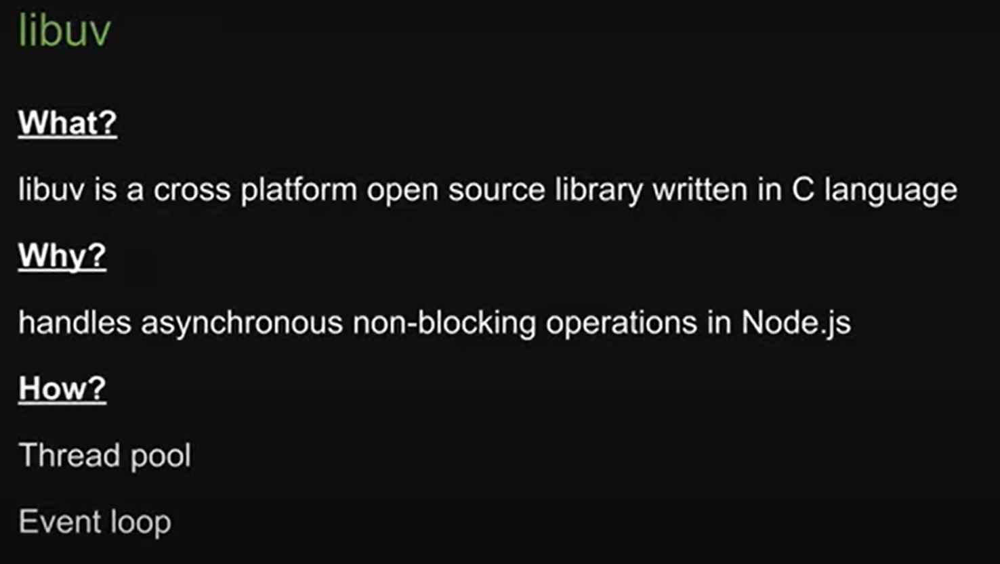
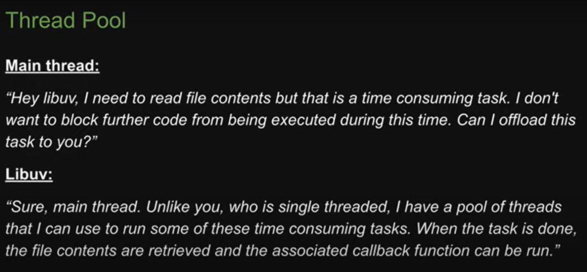
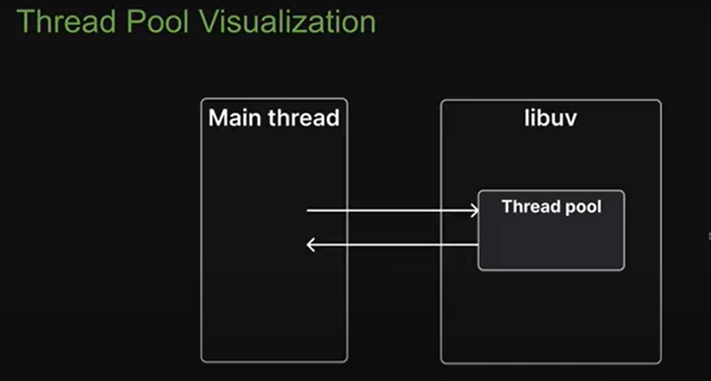
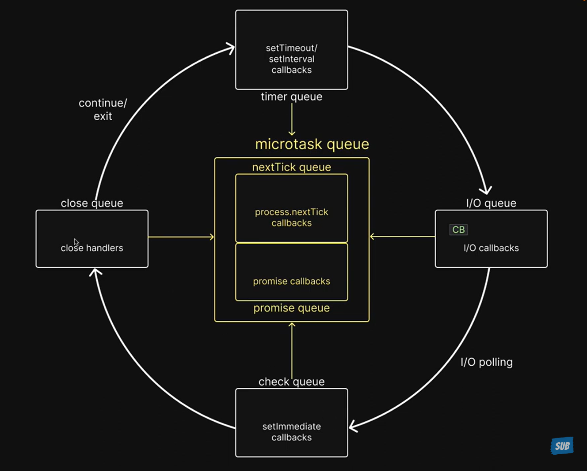

# Node.js Documentation

## Introduction
Node.js is a powerful JavaScript runtime environment made by using Chrome's V8 JavaScript engine , libuv (which is main) , c/c++ features for files support and networking features also with javascript library all bundled together to form an environment which allows javascript to run outside the browser . It allows developers to build scalable network applications using JavaScript on the server-side.

## Key Features
- Event-driven, non-blocking I/O model
- Single-threaded with event looping
- Perfect for data-intensive real-time applications
- Large ecosystem of open-source libraries (npm)

---

### Node.js Environment

Bundled with dependencies and c/c++ features with js library forms this below
environment


### Synchronous Nature of js 


### 


## If js is Synchronous then how the async task happen ? like mentioned  below fileread , https server creation etc 


## The Async nature is only achieved by the dependency LIBUV  


## What,Why,How of Libuv



after this jump to index.js

back from index.js


## The async task is send to libuv thread pool and after completion of that task its is returned to main thread.

 jump back to VIDEO 5

### Event loop is programe written in C and is a part of libuv
- A design pattern that orcherstrates or co ordiantes the ececution of sync code in node.js

MICRO_TASK QUE ARE NOT THE PART OF LIBUV REST ARE . thats why 2 words are used  orcherstrates or co ordiantes .


### PRIPORITY OF ALL THE QUEUS

NEXT_TICK_Q --> PROMISE_Q --> TIMER_Q --> I/O_Q --> CHECK_Q --> CLOSE_Q 

TIMER_Q IS NOT A QUE ,IT IS A MIN HEAP DATASTRUCTURE , IT EXECUTES IN FIFO ORDER.

MICRO_TASK = (NEXT_TICK_Q + PROMISE_Q )

IN MICRO_TASK QUES CONTROL IS KEY BUT IN ALL THE OTHER QUES IF A CB () IS GENERATED AT ANY INSTANT WHICH IS A MICRO_TASK CB() THEN CONTROL IS PASSED TO THAT MICRO_TASK QUES ON PIORITY BASIS 

### BELOW IS THE VISUAL REPRESENTATION OF EVENT LOOP



I/O QUE ALLWAYS DOES POLLING FOR THE FILE TO BE READY AND THEN THE CB() IS INVOKED IN I/O QUE

FLOW OF I/O QUEUE 

FIRST WHEN CONTROL COMES AT THE I/O QUEUE IT WILL FIRST CHECK FOR THE PAST CB() IF PRESENT IT WILL EXCECUTE & IF NOT THE I/O POLLING WILL HAPPEN AND IF THE FILE READ HAD COMPLETED IT ASSOCIATED WILL BE  ATTACHED TO THE I/O QUEUE AND THE CONTROL WILL GO TO THE CHECK QUEUE AND THE CB() ASSOCIATED WITH THE NEW FILE READ WILL BE EXCUTED IN THE SECOND ITERATION .

- THEIR IS ALSO A SPECIAL CASE FOR TIMER QUEUE WHICH STATE THAT WHEN A SETTIMEOUT FUCTION WITH 0 DELAY AND AN FS OPERATION IS THEIR WE WILL SEE AN ANOMILLE 

- IF TRACKING AS ACCORDING TO PRIOTY FIRST TIMER QUE CB 
() WILL EXECUTE AND THEN FS READ OPERATION WILL EXECUTE.

BUT ANOMILLLE IS THEIR , WE WILL NOTICE ON EXCEUTING THE FILE 3 4 TIMES FS FILE READ IS EXCEUTING FIRST THEN THE FS READ ie I/O QUEUE.

THIS HAPPENS BECAUSE WHEN WE APPLY DELAY OF 0 MS INTERNALLY IT IS A DELAY OF 1 MS

```bash

DOMTimer::DOMTimer(ExecutionContext* context, PassOwnPtrWillBeRawPtr<ScheduledAction> action, int interval, bool singleShot, int timeoutID)
    : SuspendableTimer(context)
    , m_timeoutID(timeoutID)
    , m_nestingLevel(context->timers()->timerNestingLevel() + 1)
    , m_action(action)
{
    ASSERT(timeoutID > 0);
    if (shouldForwardUserGesture(interval, m_nestingLevel))
        m_userGestureToken = UserGestureIndicator::currentToken();
    double intervalMilliseconds = std::max(oneMillisecond, interval * oneMillisecond);
    if (intervalMilliseconds < minimumInterval && m_nestingLevel >= maxTimerNestingLevel)
        intervalMilliseconds = minimumInterval;
    if (singleShot)
        startOneShot(intervalMilliseconds, FROM_HERE);
    else
        startRepeating(intervalMilliseconds, FROM_HERE);
}
DOMTimer::~DOMTimer()

```

HERE THE SNNIPPTE
```BASH
double intervalMilliseconds = std::max(oneMillisecond, interval * oneMillisecond);
```

TAKES THE MAX OUT OF 1 MS AND INTERVAL GIVEN BY  USER * BY 1MS 

IN OUR CASE MAX (1,0*1) ~ MAX (1,0) ~ MAX IS 1 MS 
SO DELAY OF 0 MS IS CONSIDERED AS 1 MS DELAY 

SO IT DEPENDS ON THE  BUSSYNESS OF CPU WHEN HE REGISTERS THIS CB() IF REGISTERED BELOW 1 MS ie (0.9 ms) THEN ORDER OF EXECUTION WILL BE TIMER QUE AND THEN I/O QUEU AND IF REGISTERED ABOVE 1MS ie (1.1 ms) THEN ORDER WILL BE REVISED I/O QUEU THEN TIMER QUEU 

IT WILL HAPPEN WITH EVERY SINGLE QUEU OF HAVING PIROTY LESS THAN TIMER QUEU . REFER VIDEO FOR MORE INFO 


